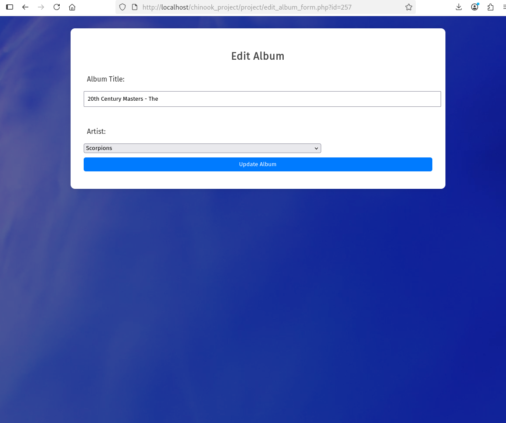
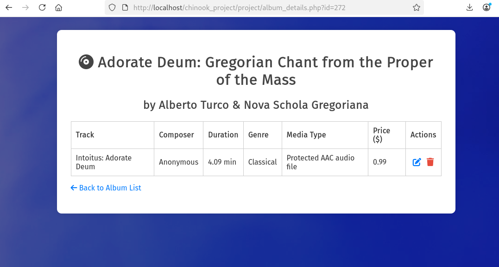
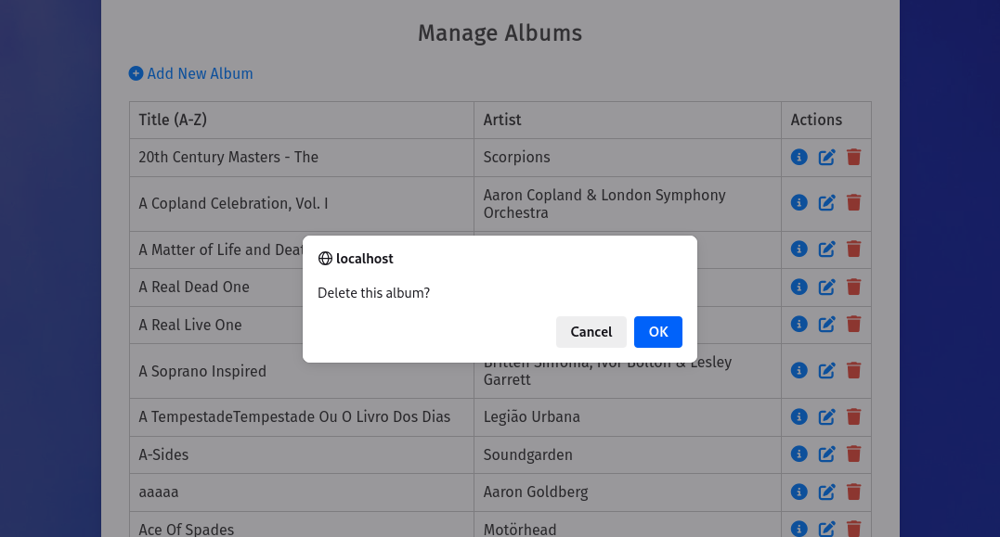
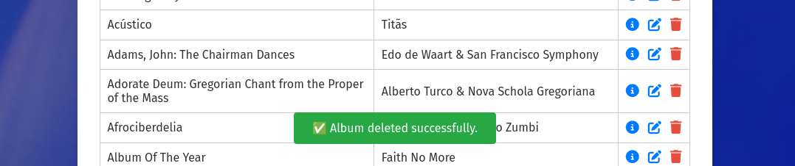

# Chinook Album Management System

## Overview
This web application allows Chinook staff to manage music albums, artists, and tracks. It provides full CRUD functionality with a clean, responsive UI.

---

## Features

### 1. **User Login**
- Staff can log in with a secure username/password.
- Session-based authentication.
- Flash messages on success/failure.

---

### 2. **Album Dashboard (index.php)**
- Lists all albums with artist names.
- Responsive table with pagination (10 per page).
- Buttons to **Add**, **Edit**, **Delete**, and **View Details**.

---

### 3. **Add Album with Tracks**
- Select artist from dropdown or enter new name.
- Dynamically add/remove track fields via JavaScript.
- Inserts album + all associated tracks.

---

### 4. **Update Album and Tracks**
- Loads existing album and its tracks.
- Allows editing of title and track names.
- Updates data in `albums` and `tracks` tables.

---

### 5. **Album Details View**
- Shows album info (title, artist).
- Lists all tracks with:
  - Composer
  - Duration (in minutes)
  - Genre and Media Type
  - Price
  - Optional play button

---

### 6. **Delete Album**
- One-click delete with confirmation.
- Flash message confirms result.

---

### 7. **Flash Messages**
- Styled success/error alerts using Font Awesome icons.
- Appears dynamically (via PHP session or JS snackbar).

---

### 8. **Responsive Design**
- Optimized for desktop and mobile.
- Tables become scrollable on small screens.
- All forms and buttons adapt to viewport.

---

### 9. **Database**
- Tables:
  - `albums`
  - `artists`
  - `tracks`
  - `genres`, `media_types` (lookup)
- Schema provided in `Chinook.sql`

---

## Technologies Used
- PHP 8
- MySQL (MariaDB)
- HTML5, CSS3 (Fira Sans, Flexbox)
- JavaScript (DOM + Event handling)

---

## Setup Instructions
1. Import `Chinook.sql` into your MySQL database.
2. Configure `config/db.php` with your DB credentials.
3. Deploy project folder under your web server (e.g., XAMPP `htdocs/`).
4. Open `index.php` in the browser.

---

## Credits
Muhammad Abdul Rahman
@marrecluse
http://marrecluse.net